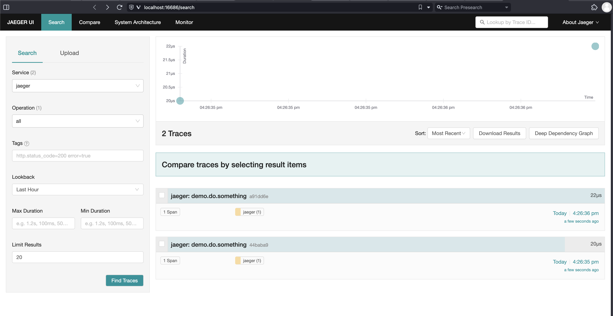

# Jaeger Tracing Example

This guide provides instructions on how to set up and run a Jaeger example. Follow the steps below to get started:

### Prerequisites

- Docker should be installed on your machine. You can download it from [here](https://www.docker.com/get-started).

### Setup Jaeger

1. Open a terminal or command prompt.

2. Run the following Docker command to set up the Jaeger container:

```shell
docker run -d --name jaeger \
    -e COLLECTOR_ZIPKIN_HOST_PORT=:9411 \
    -e COLLECTOR_OTLP_ENABLED=true \
    -p 6831:6831/udp \
    -p 6832:6832/udp \
    -p 5778:5778 \
    -p 16686:16686 \
    -p 4317:4317 \
    -p 4318:4318 \
    -p 14250:14250 \
    -p 14268:14268 \
    -p 14269:14269 \
    -p 9411:9411 \
    jaegertracing/all-in-one:1.46
```

This command starts the Jaeger container with the necessary configuration.

### Run the Example

1. In the same terminal or command prompt, navigate to the directory where your Go application files are located.

2. Run the following command to execute the Go application:

```shell
go run main.go
```


3. Open another terminal or command prompt.

4. Use the following `curl` command to send a request to the Gin API `/ping`:

```shell
curl localhost:3000/ping
```


### Accessing the Jaeger Web Interface

1. Open your web browser.

2. Visit `localhost:16686` in the address bar.

This will open the Jaeger web interface, where you can visualize and analyze the generated traces.

You should now see the traces in the Jaeger web interface similar to the image shown below:



